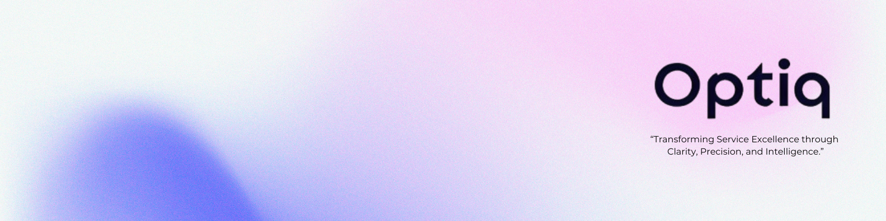

  
Optiq Solution

  <strong>Clarity. Precision. Intelligence.</strong>
    
  <a href="https://optiqsolution.com">🌐 Website</a> •
  <a href="https://optiqsolution.com#contact-us">📧 Contact</a> •
  <a href="https://optiqsolution.com#our-services">🚀 Services</a> •

## 🎯 About OptiqSolution

At **OptiqSolution**, we deliver cutting-edge technology solutions that bring **clarity** to complex challenges, **precision** to every implementation, and **intelligence** to drive your business forward. We are committed to transforming how organizations leverage technology to achieve their strategic objectives.

Our mission is to empower businesses with innovative, reliable, and scalable solutions that deliver measurable results and sustainable growth.

---

## 🛠️ Our Services

### 🔧 Technology Solutions
- **Custom Software Development** - Tailored applications built to meet your unique business requirements
- **System Integration** - Seamless integration of disparate systems for optimal workflow
- **Cloud Solutions** - Scalable cloud infrastructure and migration services
- **Digital Transformation** - Comprehensive modernization of business processes and technology

### 📊 Data & Analytics
- **Business Intelligence** - Transform raw data into actionable insights
- **Data Engineering** - Robust data pipelines and architecture design
- **Advanced Analytics** - Predictive modeling and machine learning solutions
- **Reporting & Visualization** - Interactive dashboards and comprehensive reporting

### 🔒 Security & Compliance
- **Cybersecurity Solutions** - Comprehensive security assessments and implementations
- **Compliance Management** - Ensuring adherence to industry standards and regulations
- **Risk Assessment** - Identifying and mitigating potential security vulnerabilities
- **Data Protection** - Advanced data encryption and privacy solutions

### 🎯 Consulting Services
- **Technology Strategy** - Align technology initiatives with business objectives
- **Process Optimization** - Streamline operations for maximum efficiency
- **Project Management** - Expert project delivery using industry best practices
- **Change Management** - Smooth transition and adoption of new technologies

---

## 💡 Why Choose OptiqSolution?

<table>
<tr>
<td align="center"><strong>🎯 Clarity</strong> Clear communication, transparent processes, and well-defined project deliverables</td>
<td align="center"><strong>⚡ Precision</strong> Meticulous attention to detail and accurate implementation of solutions</td>
<td align="center"><strong>🧠 Intelligence</strong> Smart, data-driven decisions and innovative problem-solving approaches</td>
</tr>
</table>

### 🌟 Our Differentiators
- ✅ **Proven Track Record** - Successful delivery of 100+ projects across various industries
- ✅ **Expert Team** - Certified professionals with deep domain expertise
- ✅ **Agile Methodology** - Flexible and iterative approach to project delivery
- ✅ **24/7 Support** - Round-the-clock technical support and maintenance
- ✅ **Scalable Solutions** - Future-ready systems that grow with your business

---

## 🏢 Industries We Serve

| **Financial Services** | **Healthcare** | **Manufacturing** | **Retail & E-commerce** |
|:-----------------------:|:--------------:|:-----------------:|:------------------------:|
| 🏦 Banking & Insurance  | 🏥 Hospitals   | 🏭 Automation     | 🛒 Digital Commerce     |

| **Technology** | **Education** | **Government** | **Logistics** |
|:--------------:|:-------------:|:--------------:|:-------------:|
| 💻 Software    | 🎓 Learning   | 🏛️ Public      | 🚚 Supply     |

## 📞 Contact Us

**Ready to transform your business with intelligent technology solutions?**

📧 **Email:** [contact@optiqsolution.com](mailto:info@optiqsolution.com)  
🌐 **Website:** [www.optiqsolution.com](https://optiqsolution.com)  
📱 **Phone:** +1 (905) 981-8019  
📍 **Address:** Remote

---

  <strong>OptiqSolution - Where Technology Meets Excellence</strong> 
  <em>Clarity. Precision. Intelligence.</em>

